
<a href="https://luffm.github.io/Jigsaw-Puzzles/">Jigsaw Puzzles</a>

## Magical Witch (KEI)
2026-04-30 
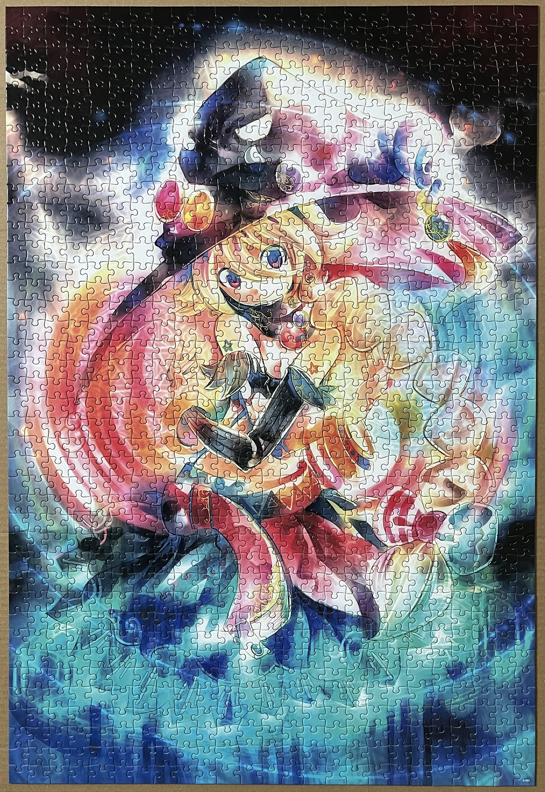
 1000 pieces

## My Neighbor Totoro
2026-04-19 
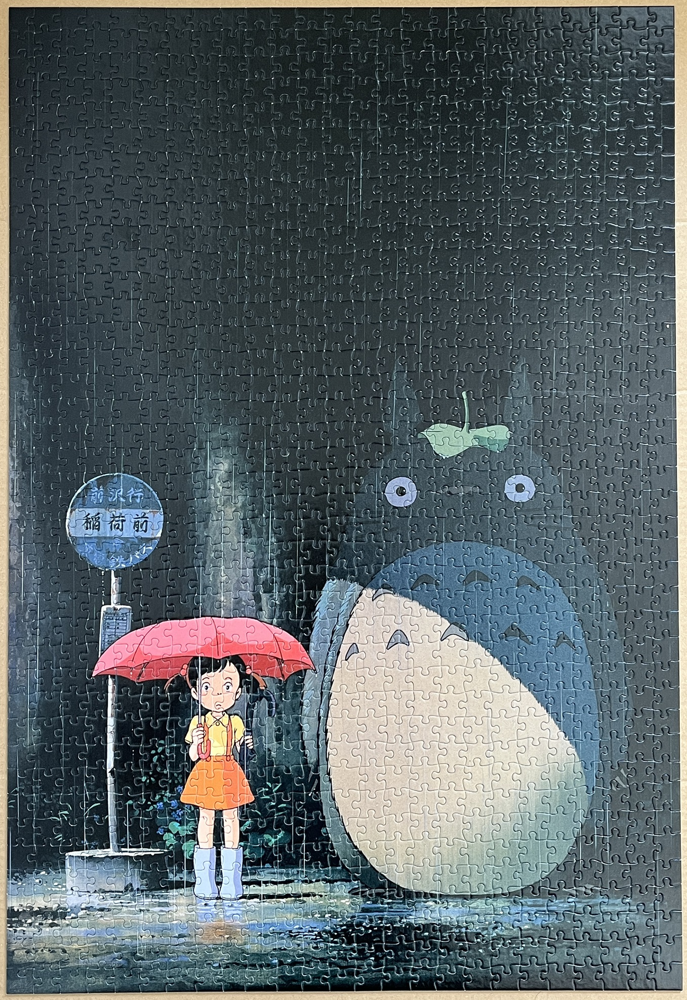
 1000 pieces

## Napoleon Crossing Alps (J.M. Langloix)
2026-04-07 
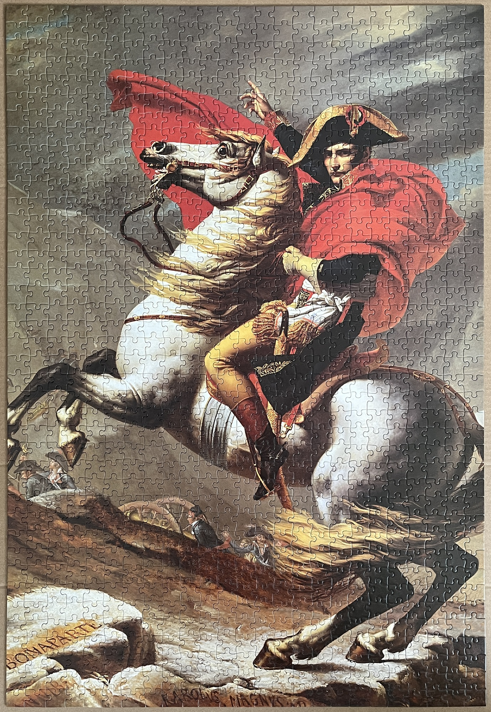
 1000 pieces

## Edge of Eden (Takaki)
2025-04-06 
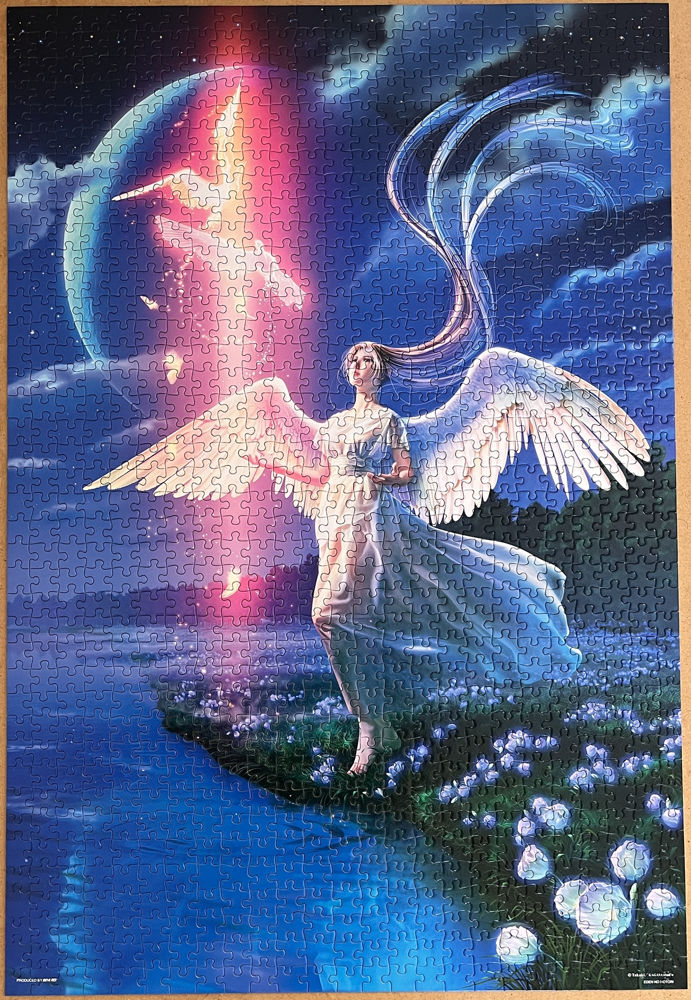
 1000 pieces

## Alice in Wonderland (Kaoru Chiaki)
2024-05-11 
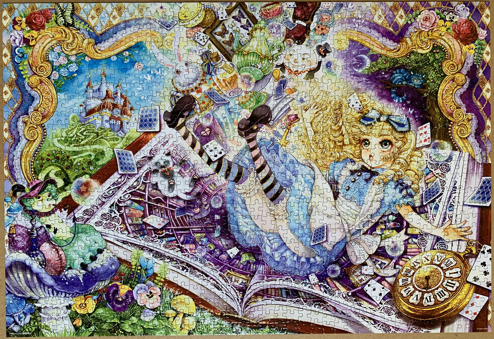
 1000 pieces

## Heavenly Blade (Kazuha Fukami)
2024-02-02 
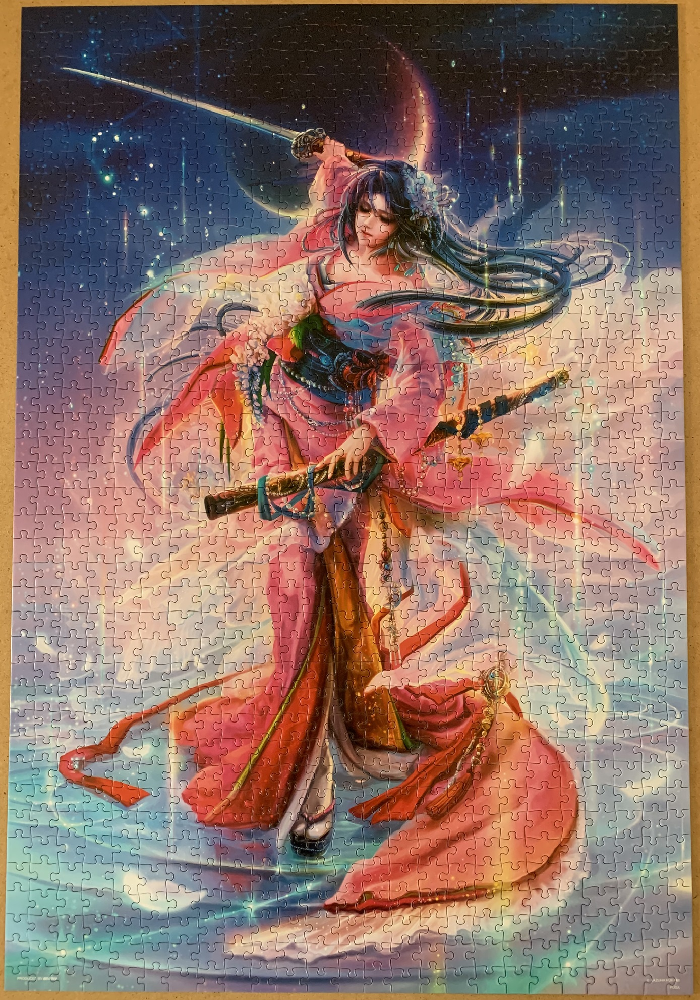
 1000 pieces

## English Farmhouse (Earlene Moses)
2023-02-02 
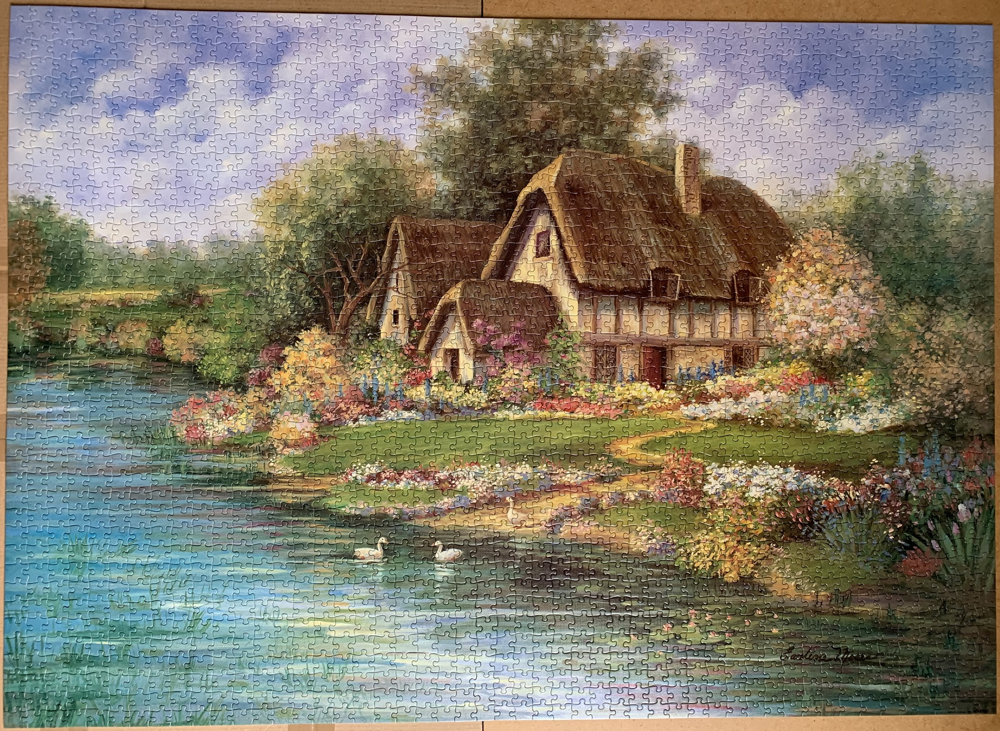
 2000 pieces

## The Story of the Starry Sky - 48 Constellations (Takaki)
2022-10-25 
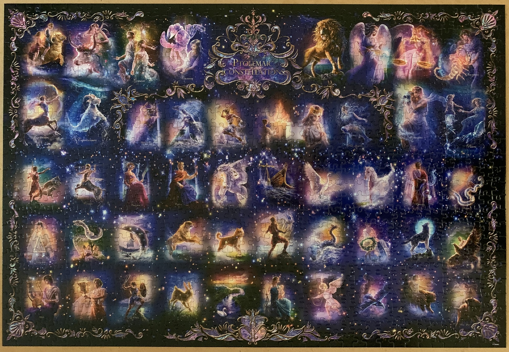
 1000 pieces

## Monet's Garden (James Scoppettone)
2022-08-02 
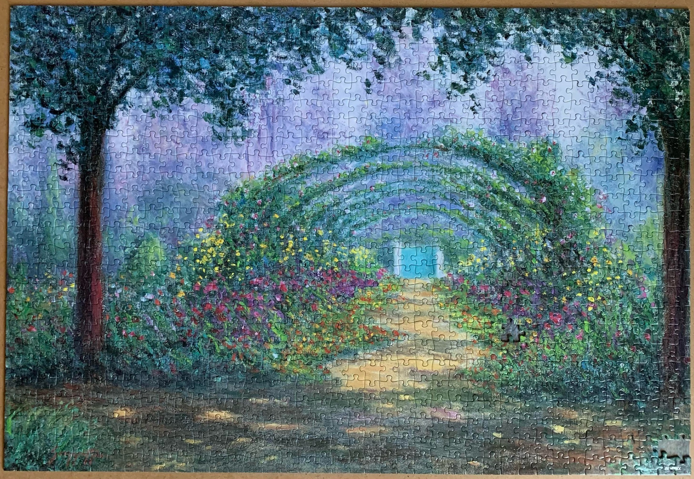
 1000 pieces

## K-On in London
2022-06-04 
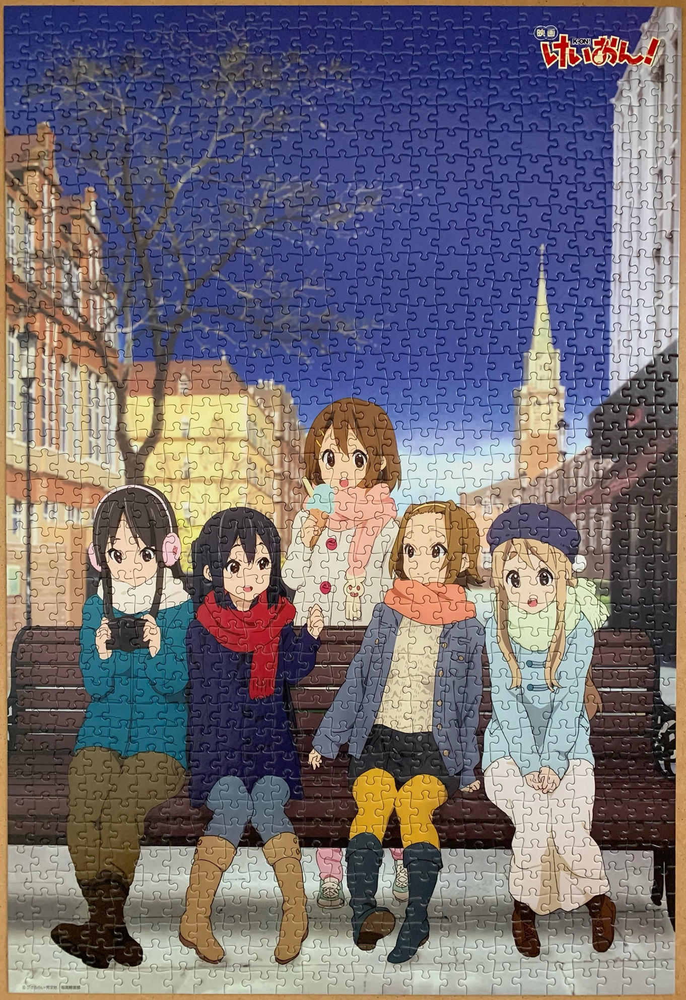
 1000 pieces

## Map of Japan
2022-01-15 
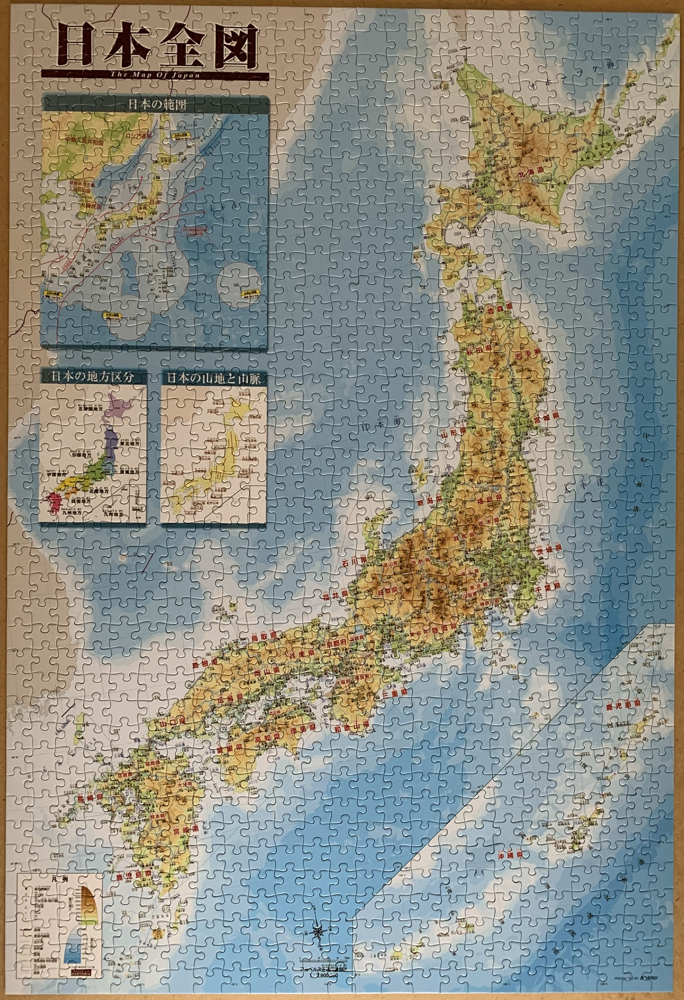
 1000 pieces

## Jigsomania
2021-10-17 
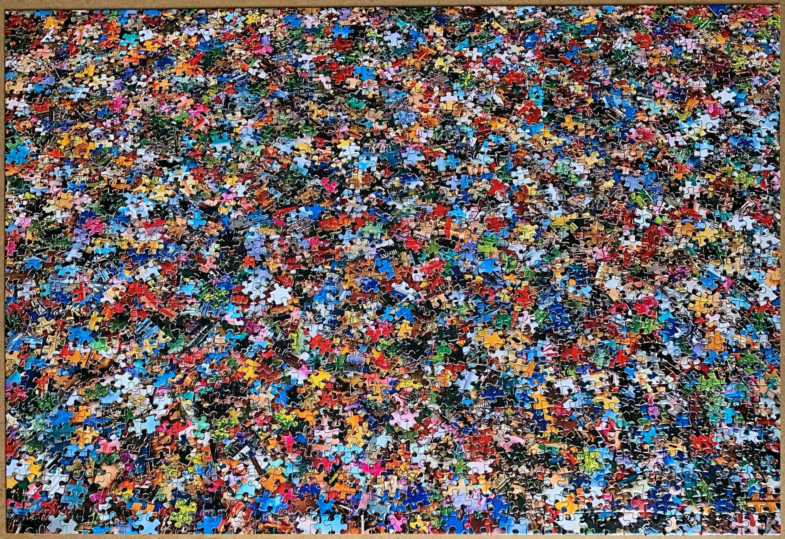
 1000 pieces

<a href="https://luffm.github.io/Jigsaw-Puzzles/">Jigsaw Puzzles</a>

